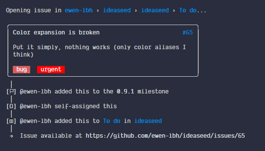
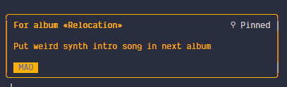
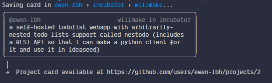

# Changelog

All notable changes to this project will be documented in this file.

The format is based on [Keep a Changelog](https://keepachangelog.com/en/1.0.0/),
and this project adheres to [Semantic Versioning](https://semver.org/spec/v2.0.0.html).

## [1.1.0] - 2021-05-08

### Added

- Default flag overrides for the 'user' command (`--default-user-project ` and `--default-user-column`)
- Ability to save local copies of ideas as plaintext files on your disk, with flag `--local-copy`
- A `--debug` flag to print debugging information

### Changed

- When using `--color`, the cards have their background colored instead of their text and have no borders (See [`5041355`](https://github.com/ewen-lbh/ideaseed/commit/5041355))
- When using Google Keep, if `--color` is `White`, the card has no background color and appears with a border, the same way as Github cards do

### Fixed

- Link for milestone being to the API (see [#161](https://github.com/ewen-lbh/ideaseed/issues/161))
- Crash when selecting non-existent milestone without `--create-missing` (See [#158](https://github.com/ewen-lbh/ideaseed/issues/158))
- Cards weren't escaped from Rich's markup syntax (See [#163](https://github.com/ewen-lbh/ideaseed/issues/163))
- The “Upgrade available” notification was not formatted properly (See [#160](https://github.com/ewen-lbh/ideaseed/issues/160))

## [1.0.0] - 2021-04-18

### Added

- Ability to choose where to store authentication data ('auth cache')
- update command to update ideaseed
- AUR packages! see [ideaseed](https://aur.archlinux.org/packages/ideaseed) (synced with PyPI) and [ideaseed-git](https://aur.archlinux.org/packages/ideaseed-git) (bleeding edge, using the latest commit)
- A warning when adding the issue to a closed milestone ([but warns of the opposite because of a bug, whoops!](https://github.com/ewen-lbh/ideaseed/issues/159))

### Changed

- Reduce friction when connecting to Google Keep from a 2FA-secured account
- All-new UI using [rich](https://pypi.org/project/rich), including
- Full markdown (commonmark) rendering
- Revamped Card
- Revamped 'timeline' (now just a listing of properties)
- New prompts (not necessarily better, but good enough. This was done to not depend on enquirer anymore, and use rich's prompts.)
- Revamped "update available" notification
- One clear banner when running in dry-run mode
- More intuitive CLI, using a bunch of positional arguments. See 0f86a87 and related issues (#112 mainly)
- about, config and version are now commands instead of flags (do `ideaseed config` instead of `ideaseed --config`, for example.)
- `--no-*` flags are now --* (i.e. negative flags are positive) (e.g. --no-check-for-updates is now --check-for-updates)
- The update checking is less intrusive, the notification just tells you that an update is available, but does not ask for upgrading
- Creating issues is now the default behavior. A new flag `-I`/`--no-issue` has been created to prevent issue creation.
- `--assign` now works for Google Keep
- Remove all references to "tags" -- github "tags" are actually also _labels_, so this "tag" wording has nothing to do in ideaseed

### Removed

- Color shorthands. You'll have to type out the full color name now. Note that aliases (e.g. gray -> grey) are still around.
- Deprecated shorthand flags `-l` and `-t` as well as flag `--tag`

### Fixed

- Crash with google keep (see #100)
- Authentication data wasn't cached for Google Keep

## [0.11.0] - 2020-06-29

### Added

- `--config`: A configuration wizard that asks you some questions and sets up the alias for you. The alias is automatically added to the shell's rc file, provided that your login shell is either:
- fish
- bash
- zsh
- csh (not tested)
- ksh (not tested)
- tcsh (not tested)

### Changed

- Made the "this option cannot be used with Google Keep" more helpful by suggesting to specify a repository
- When you decide to update via the notification, if your upgrade includes a _major_ version bump (i.e. potentially breaking changes happen), the script won't re-run your command automatically to prevent potential problems (eg. you did `ideaseed -ttagname`, then decided to upgrade to `v1.0.0`, but with this new version `-t` is now a shorthand for `--title` instead of `--tag`. `ideaseed -ttagname` won't be run again automatically with the new version to prevent potentially "dangerous" actions)
- The blue accent color used at multiple places was a fixed color, `#268CCE`. It now uses the `blue` ANSI color so that the program uses _your_ blue and conforms to _your_ terminal color scheme.
- Markdown _italic text_, **bold text** and emojis (eg. :penguin:) are rendered in the changelog
- All markdown is rendered in cards (issues, projects and also Google Keep cards), including _italics_, **bold** and emojis.

### Fixed

- A debug `print()` managed to slip through and get into the previous releases (it looked like `bug is ff0000`, and was printing the label name and its color hex code)
- Crash when the `--user-project` was not found or the column of a user project was not found

## [0.10.2] - 2020-06-24

### Fixed

- Prevent update notification from appearing again after an update
- Fix wrong version appearing in: update notification, message, about screen version

## [0.10.1] - 2020-06-24

### Fixed

- Fix crash when adding issue with labels whose hex color representation starts with zero

## [0.10.0] - 2020-06-24

### Added

- New flag `--dry-run`: Run your commands without creating new cards or issues, but see what it'd run. Mostly used by me for UI testing, but could be useful to some people. (#37)
- New flag shorthand `-#` for `--label` (See #28)
- New flags to change default values for the project and the column: `--default-project` and `--default-column`. Use them in your alias :) (See #30)

### Changed

- #### Several UI improvements for cards
- Increased spacing between different sections of the cards
- Get rid of the ugly line separator in cards (#34)
- Show labels with their background colors instead of using `[label name]` (#25 and #53)
- Make note content stand out more for project cards created without `--issue` by dimming the card header (#59)
- 
- 
- 
- When attempting to reference missing things without using `--create-missing`, the error message includes a "tip" (#63)
- The 'What has changed?' option now handles correctly upgrading from more than one version away: it prints all the changes that the user needs to know, and not only the latest ones. eg: I'm upgrading from 0.6.0 to 0.10.0, but there has been 0.8.0 and 0.9.0 in between, I want all the changes, not just the ones from 0.9.0 to 0.10.0

### Fixed

- Labels are created even if 'no' is answered in the prompt (#26)
- Google Keep cards creation when labels were missing (#71 and #51)
- The card was created and its UI shown _before_ prompting to create missing labels, resulting in an internal exception raised by gkeepapi when trying to add a non-existant label (`None has no attribute 'id'`)
- The message to confirm creation of labels had no message (#51)

## [0.9.1] - 2020-06-23

### Fixed

- Fix `--color` only accepting aliases (#65)

## [0.9.0] - 2020-06-22

### Added

- ideaseed now has a logo! 
- New flag `-@`/`--assign-to` to assign issues to one or more person. Not specifying this flag still self-assigns you just as before
- New flag `-M`/`--milestone` to add issues to a milestone
- New flag `--no-self-assign` to prevent self-assigning issues.
- Update notification: New option "What has changed?" to read release notes before upgrading

### Changed

- Improved contrast inside cards with bold and colored text
- Colored Google Keep cards see their _text_ colored, not their background, which I thought looked a bit ugly.
- Improved Google Keep "logging in..." messages: before 0.9.0, the previous line was erased and "Logging in..." was replaced with "Logged in.". This is pretty cool, but does not work well when there's something else that gets printed, for example when you need to enter credentials to log in. The line no longer gets replaced, but "✅ Logged in." gets printed instead.
- Improved error messages when validating options presence

### Fixed

- The third example in the `--help` screen was missing a COLUMN argument

## [0.8.1] - 2020-06-20

### Fixed

- Fix update notification from appearing
- Fix wrong version appearing in: update notification message, about screen, version

## [0.8.0] - 2020-06-20

### Changed

- Revamped UI when adding cards to Google Keep: , GitHub with --issue:  and without --issue: 
- Revamped "Logging in..." message for Google Keep

## [0.7.0] - 2020-06-19

### Added

- [[#19](https://github.com/ewen-lbh/ideaseed/issues/19)] Option `-l`/`--label`: alias for `--tag`.

### Fixed

- A `KeyError: 'color'` was raised when creating a label.

## [0.6.0] - 2020-06-19

### Added

- [[#5](https://github.com/ewen-lbh/ideaseed/issues/5)] Add `--pin` to pin Google Keep cards

## [0.5.0] - 2020-06-19

### Added

- [[#9](https://github.com/ewen-lbh/ideaseed/issues/9)] Make `--tag` work with `--issue`: When creating an issue, `--tag=TAG` means "Add label `TAG` to the created issue".

## [0.4.1] - 2020-06-19

### Fixed

- Fix error "undeclared variable `Literal`" (from `cli_box`).

## [0.4.0] - 2020-06-18

### Added

- [[#10](https://github.com/ewen-lbh/ideaseed/issues/10)] Add "Update available" notification when a new update is available, and prompts to download the new version, then re-runs the command using the new version.

## [0.3.0] - 2020-06-17

### Added

- [[#15](https://github.com/ewen-lbh/ideaseed/issues/15)] Add aliases for color names: "cyan" means "teal", "magenta" means "purple", etc. (see `ideaseed --help`, section "Color names") Those aliases behave like other colors, and thus `--color cy` expands to `cyan`, which is then resolved to `teal`.

### Fixed

- When using Google Keep, the "Logging in..." message was printed only when the login was finished (at the same time as " Done.").

## [0.2.1] - 2020-06-16

### Fixed

- Fix `AuthenticatedUser has no attribute 'get_projects'` when using user profile projects.

## [0.2.0] - 2020-06-16

### Added

- Add option `-o`/`--open`: Open the relevant URL in your webbrowser (eg. open "https://github.com/owner/repository/issues/issue-number" after creating an issue)

### Fixed

- Fix default color generating a `KeyError`
- Initial release. See <https://pypi.org/project/ideaseed/0.1.0/> for documentation.

## [0.1.0] - 2020-06-16

[Unreleased]: https://github.com/ewen-lbh/ideaseed/compare/v1.1.0...HEAD
[1.1.0]: https://github.com/ewen-lbh/ideaseed/compare/v1.0.0...v1.1.0
[1.0.0]: https://github.com/ewen-lbh/ideaseed/compare/v0.11.0...v1.0.0
[0.11.0]: https://github.com/ewen-lbh/ideaseed/compare/v0.10.2...v0.11.0
[0.10.2]: https://github.com/ewen-lbh/ideaseed/compare/v0.10.1...v0.10.2
[0.10.1]: https://github.com/ewen-lbh/ideaseed/compare/v0.10.0...v0.10.1
[0.10.0]: https://github.com/ewen-lbh/ideaseed/compare/v0.9.1...v0.10.0
[0.9.1]: https://github.com/ewen-lbh/ideaseed/compare/v0.9.0...v0.9.1
[0.9.0]: https://github.com/ewen-lbh/ideaseed/compare/v0.8.1...v0.9.0
[0.8.1]: https://github.com/ewen-lbh/ideaseed/compare/v0.8.0...v0.8.1
[0.8.0]: https://github.com/ewen-lbh/ideaseed/compare/v0.7.0...v0.8.0
[0.7.0]: https://github.com/ewen-lbh/ideaseed/compare/v0.6.0...v0.7.0
[0.6.0]: https://github.com/ewen-lbh/ideaseed/compare/v0.5.0...v0.6.0
[0.5.0]: https://github.com/ewen-lbh/ideaseed/compare/v0.4.1...v0.5.0
[0.4.1]: https://github.com/ewen-lbh/ideaseed/compare/v0.4.0...v0.4.1
[0.4.0]: https://github.com/ewen-lbh/ideaseed/compare/v0.3.0...v0.4.0
[0.3.0]: https://github.com/ewen-lbh/ideaseed/compare/v0.2.1...v0.3.0
[0.2.1]: https://github.com/ewen-lbh/ideaseed/compare/v0.2.0...v0.2.1
[0.2.0]: https://github.com/ewen-lbh/ideaseed/compare/v0.1.0...v0.2.0
[0.1.0]: https://github.com/ewen-lbh/ideaseed/releases/tag/v0.1.0

[//]: # (C3-2-DKAC:GGH:Rewen-lbh/ideaseed:Tv{t})
