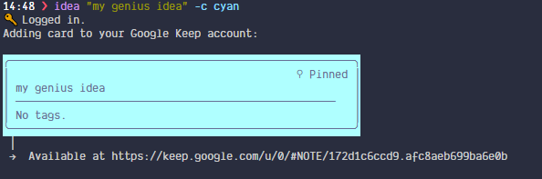
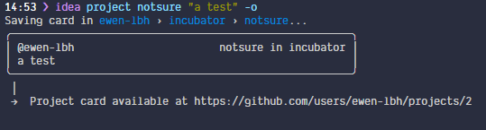
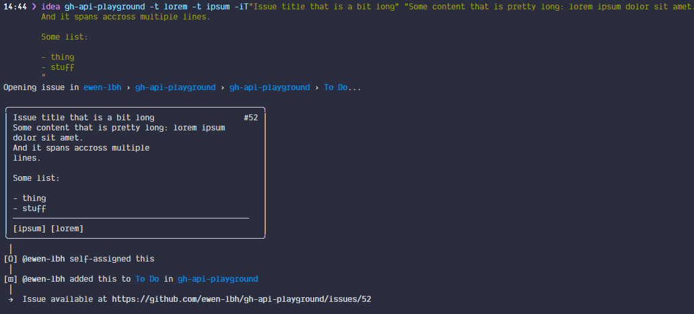

# Changelog
All notable changes to this project will be documented in this file.

The format is based on [Keep a Changelog](https://keepachangelog.com/en/1.0.0/),
and this project adheres to [Semantic Versioning](https://semver.org/spec/v2.0.0.html).

## [Unreleased]

## [0.9.1] - 2020-06-23

### Fixed

- Fix `--color` only accepting aliases (#65)

## [0.9.0] - 2020-06-22

### Fixed

- The third example in the `--help` screen was missing a COLUMN argument

### Added

- ideaseed now has a logo! 

- New flag `-@`/`--assign-to` to assign issues to one or more person. Not specifying this flag still self-assigns you just as before
- New flag `-M`/`--milestone` to add issues to a milestone
- New flag `--no-self-assign` to prevent self-assigning issues.
- Update notification: New option "What has changed?" to read release notes before upgrading

### Changed

- Improved contrast inside cards with bold and colored text
- Colored Google Keep cards see their _text_ colored, not their background, which I thought looked a bit ugly.
- Improved Google Keep "logging in..." messages:
  before 0.9.0, the previous line was erased and "Logging in..." was replaced with "Logged in.".
  This is pretty cool, but does not work well when there's something else that gets printed, for example when you need to enter credentials to log in. The line no longer gets replaced, but "✅ Logged in." gets printed instead.
- Improved error messages when validating options presence

## [0.8.1] - 2020-06-20

### Fixed

- Fix update notification from appearing
- Fix wrong version appearing in:
  - update notification message
  - --about screen
  - --version

## [0.8.0] - 2020-06-20

### Changed

- Revamped UI when adding cards:
  - to Google Keep: 
  - to GitHub:
    - with --issue: 
    - without --issue: 

- Revamped "Logging in..." message for Google Keep

## [0.7.0] - 2020-06-19

### Added

- [[#19](https://github.com/ewen-lbh/ideaseed/issues/19)] Option `-l`/`--label`: alias for `--tag`.

### Fixed

- A `KeyError: 'color'` was raised when creating a label.

## [0.6.0] - 2020-06-19

### Added

- [[#5](https://github.com/ewen-lbh/ideaseed/issues/5)] Add `--pin` to pin Google Keep cards

## [0.5.0] - 2020-06-19

### Added

- [[#9](https://github.com/ewen-lbh/ideaseed/issues/9)] Make `--tag` work with `--issue`: When creating an issue, `--tag=TAG` means "Add label `TAG` to the created issue".

## [0.4.1] - 2020-06-19

### Fixed

- Fix error "undeclared variable `Literal`" (from `cli_box`).

## [0.4.0] - 2020-06-18

### Added

- [[#10](https://github.com/ewen-lbh/ideaseed/issues/10)] Add "Update available" notification when a new update is available, and prompts to download the new version, then re-runs the command using the new version.

## [0.3.0] - 2020-06-17

### Added

- [[#15](https://github.com/ewen-lbh/ideaseed/issues/15)] Add aliases for color names: "cyan" means "teal", "magenta" means "purple", etc. (see `ideaseed --help`, section "Color names") Those aliases behave like other colors, and thus `--color cy` expands to `cyan`, which is then resolved to `teal`.

### Fixed

- When using Google Keep, the "Logging in..." message was printed only when the login was finished (at the same time as " Done.").

## [0.2.1] - 2020-06-16

### Fixed

- Fix `AuthenticatedUser has no attribute 'get_projects'` when using user profile projects.

## [0.2.0] - 2020-06-16

### Added

- Add option `-o`/`--open`: Open the relevant URL in your webbrowser (eg. open "https://github.com/owner/repository/issues/issue-number" after creating an issue)

### Fixed

- Fix default color generating a `KeyError`
  
## [0.1.0] - 2020-06-16

Initial release. See <https://pypi.org/project/ideaseed/0.1.0/> for documentation.

[Unreleased]: https://github.com/ewen-lbh/ideaseed/compare/v0.9.1...HEAD
[0.9.1]: https://github.com/ewen-lbh/ideaseed/compare/v0.9.0...v0.9.1
[0.9.0]: https://github.com/ewen-lbh/ideaseed/compare/v0.8.1...v0.9.0
[0.8.1]: https://github.com/ewen-lbh/ideaseed/compare/v0.8.0...v0.8.1
[0.8.0]: https://github.com/ewen-lbh/ideaseed/compare/v0.7.0...v0.8.0
[0.7.0]: https://github.com/ewen-lbh/ideaseed/compare/v0.6.0...v0.7.0
[0.6.0]: https://github.com/ewen-lbh/ideaseed/compare/v0.5.0...v0.6.0
[0.5.0]: https://github.com/ewen-lbh/ideaseed/compare/v0.4.1...v0.5.0
[0.4.1]: https://github.com/ewen-lbh/ideaseed/compare/v0.4.0...v0.4.1
[0.4.0]: https://github.com/ewen-lbh/ideaseed/compare/v0.3.0...v0.4.0
[0.3.0]: https://github.com/ewen-lbh/ideaseed/compare/v0.2.1...v0.3.0
[0.2.1]: https://github.com/ewen-lbh/ideaseed/compare/v0.2.0...v0.2.1
[0.2.0]: https://github.com/ewen-lbh/ideaseed/compare/v0.1.0...v0.2.0
[0.1.0]: https://github.com/ewen-lbh/ideaseed/releases/tag/v0.1.0
